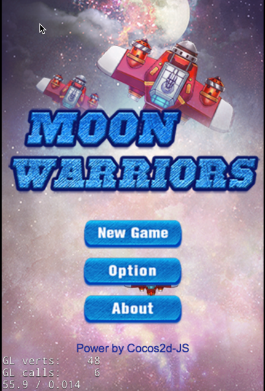
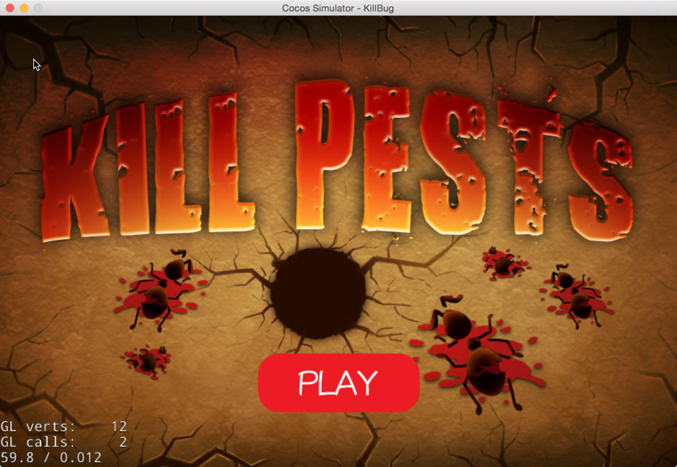

# Cocos2d-x-samples

[TOC]

Contains different samples that show how to use Cocos2d-x v3.2 with 3rd party libraries:

## Running the samples

### Download

``` 
$ git clone https://github.com/cocos2d/cocos2d-x-samples.git
$ cd cocos2d-x-samples
$ python download-engine.py
```

### Running

Once the samples were downloaded just go any sample, and open the project. eg:

``` 
$ cd cocos2d-x-samples/samples/LiquidFun-Testbed/proj.ios_mac
$ open LiquidFun-Testbed.xcodeproj/
```

## Available samples:

### LiquidFun

Based on [Box2d](box2d.org), [LiquidFun](http://google.github.io/liquidfun/) features particle-based fluid simulation. Game developers can use it for new game mechanics and add realistic physics to game play. Designers can use the library to create beautiful fluid interactive experiences.

We provide 2 samples:

#### LiquidFun - Testbed


The Testbed that comes with LiquidFun, adapted for cocos2d-x.

Supported platforms:

- iOS
- Mac
- Win32

#### LiquidFun - EyeCandy


The Eye Candy demo that comes with LiquidFun, adapted for cocos2d-x. Includes two useful classes:

- `LFParticleSystemNode`: Wraps a LiquidFun `b2ParticleSystem` into a cocos2d-x node.
- `LFPhysicsSpriteNode`: Wraps a LiquidFun `b2Body` into a cocos2d-x node.

Supported platforms:

- iOS

### GAF 


From [GAF](http://gafmedia.com/about) homepage:

_"GAF stands for Generic Animation Format. GAF is designed to store Flash animations in an open cross platform format for further playback in a multitude of game development frameworks and devices. GAF enables artists and animators to use Flash CS for creating complex animations and seamlessly use them with various game development frameworks."_

This sample shows how to use GAF with cocos2d-x. It has 5 different GAF samples and shows how to play sound events with GAF.

Supported platforms:

- iOS
- Android

### MoonWarriors



This is a built-in showcase of Cocos2d-JS, including many features just as:

- Parallax background
- Tilemap
- Actions
- Ease
- Frame animation
- Schedule
- Labels
- Keyboard Dispatcher
- Scene Transition.

Art and audio is copyrighted by Enigmata Genus Revenge, you may not use any copyrigted material without permission.

This showcase is licensed under MIT. You’re welcome to use this as a simple tutorial for your upcoming html5 game

Supported platforms:

- iOS
- Mac
- Win32
- WinPhone
- Android

### KillBug

This is a type of mini-games to test agility of cocos2d-lua, the players need to kill the spider which kept  move into the middle hole.



Supported platforms:

- iOS
- Mac
- Win32
- Android

## How To Create New Samples

### 1、init environment

	$ python download-engine.py

	$ cd libs/cocos2d-x

	$ python setup.py

### 2、create new sample

	$ cd samples

	$ cocos new ProjectName -l [cpp or js or lua] 

**attension: only create projectName in samples dir, it will be compiled correctly**